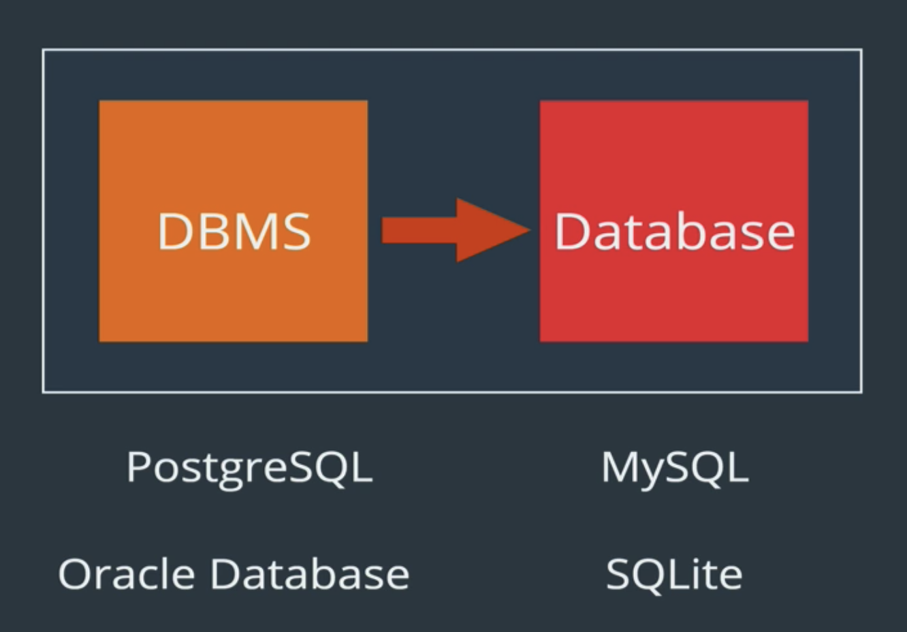
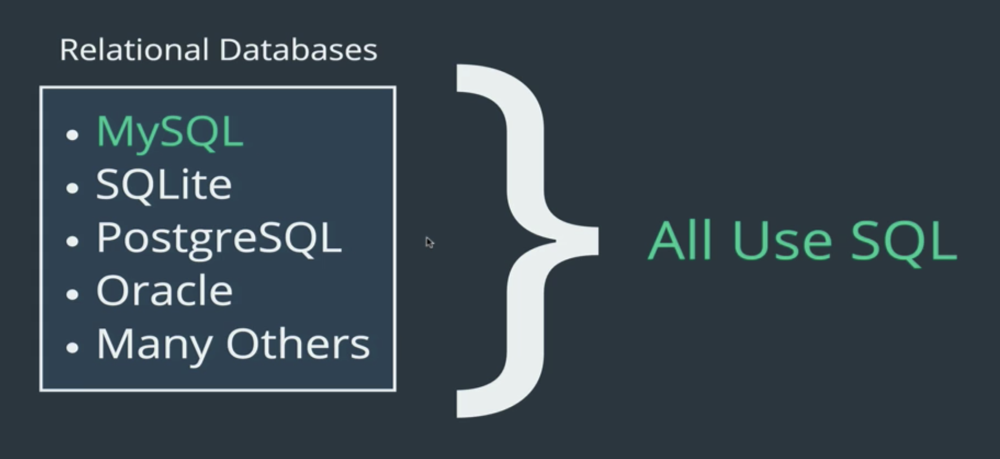
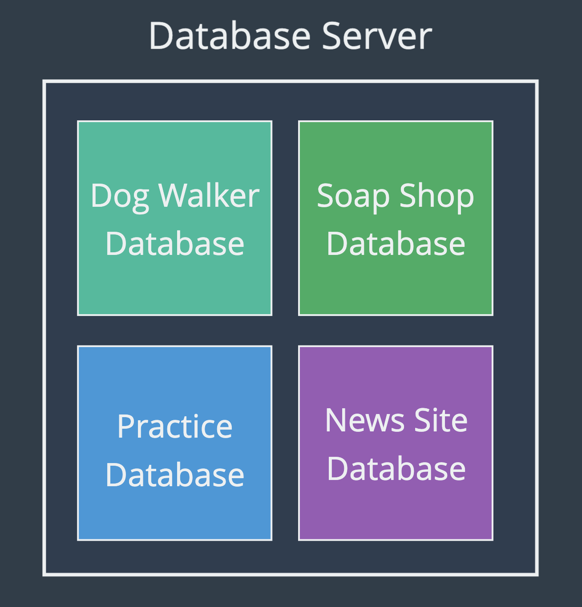
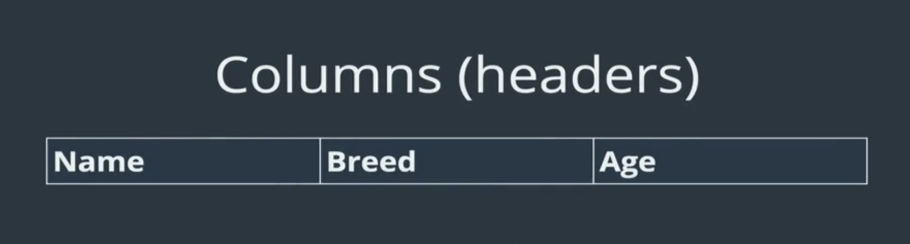
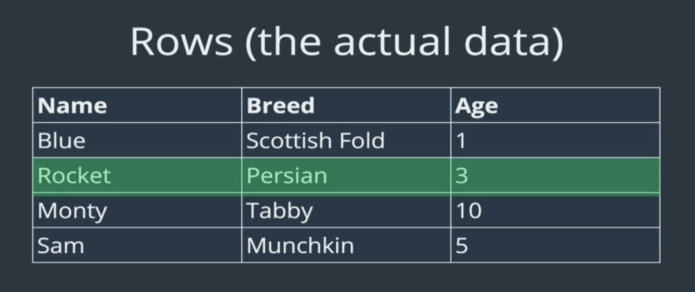
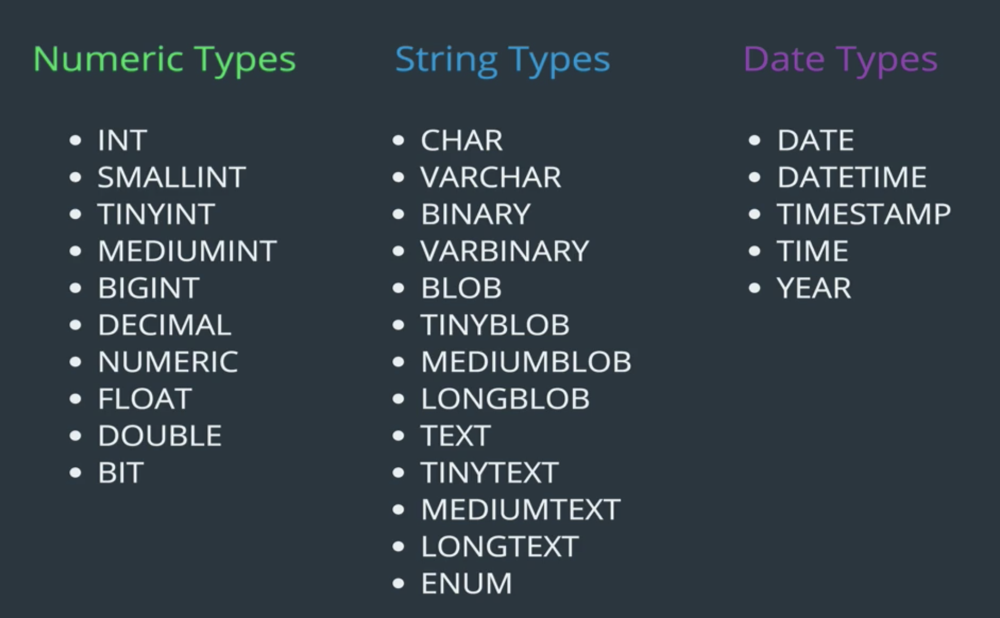

# Summary of The Ultimate MySQL Bootcamp
Summary of The Ultimate MySQL Bootcamp by Colt Steele. The goal of this course :
- Learn the ins and outs of SQL syntax
- Generate reports using sales and user data
- Analyze data using Aggregate Functions
- Run complex queries using MySQL logical operators and string functions
- Write all the common SQL joins
- Work with large datasets containing thousands of entries
- Build a web app using MySQL and NodeJS
- Design and implement complex database schemas
- Learn to navigate the treacherous world of storing dates and times
- Clone the database structure of a photo sharing social network
- Write Javascript code to generate fake data sets
- And more!

# Overview
### What is a database?
In computing, a database is an organized collection of data stored and accessed electronically. Small databases can be stored on a file system, while large databases are hosted on computer clusters or cloud storage. And to simplify :
- A colection of data
- A method for accessing and manipulating data
- A structured set of computerized data with an accessible interface

### Database vs Database Management System (DBMS)
A database is a logically modeled cluster of information [data] that is typically stored on a computer or other type of hardware that is easily accessible in various ways. A database management system is a computer program or other piece of software that allows one to access, interact with, and manipulate a database.


### SQL vs MySQL
SQL is used for accessing, updating and maintaining data in a database and MySQL is an RDBMS (Relational Database Management System) that allows users to keep the data that exists in a database organized. SQL does not change (much), as it is a language. MySQL updates frequently as it is a piece of software.


In a nutshell, SQL is a language for querying databases and MySQL is an open source database product.

### Cloud9
AWS Cloud9 is a cloud-based integrated development environment (IDE) that lets you write, run, and debug your code with just a browser. It includes a code editor, debugger, and terminal. 

Cloud9 comes prepackaged with essential tools for popular programming languages, including JavaScript, Python, PHP, and more, so you don’t need to install files or configure your development machine to start new projects. Since your Cloud9 IDE is cloud-based, you can work on your projects from your office, home, or anywhere using an internet-connected machine. 

Cloud9 also provides a seamless experience for developing serverless applications enabling you to easily define resources, debug, and switch between local and remote execution of serverless applications. With Cloud9, you can quickly share your development environment with your team, enabling you to pair program and track each other's inputs in real time.

### goormIDE
goormIDE is developer-focused cloud IDE to maximize your productivity. Individuals can use goormIDE for open-source projects or personal use. 
Companies can also apply their platform-specific tools and their own specialized development processes.

With goormIDE, you can develop software more efficiently in a business unit. For example, developers can share opinions in real time through communication functions and edit the source code at the same time.

[Cheat Sheet For MySQL with goorm](https://gist.github.com/nax3t/767e06f6af0bafc70b4c4cba0c8d38e7)

# Creating Databases and Tables

to create database use command :
> CREATE DATABASE database_name;

to drop database use command :
> DROP database_name

to use database use command :
> USE database_name

### Tables
A table is a collection of related data held in a table format within a database. It consists of columns and rows. In relational databases, and flat file databases, a table is a set of data elements using a model of vertical columns and horizontal rows, the cell being the unit where a row and column intersect. 

A database made up of lots of tables



### Tables Data types
Data types in SQL Server are organized into the following categories:
- INT
- STRING
- DATE


### Creating Tables
```
CREATE TABLE tablename (
column_name data_type
);
```
example :
```
CREATE TABLE cats
  (
    name VARCHAR(100),
    age INT
  );
```
to check if the table worked :
```
SHOW TABLES;
 
SHOW COLUMNS FROM tablename;
```
to drop tables use command :
> DROP TABLE tablename;

# Inserting Data
The "formula":
> INSERT INTO table_name(column_name) VALUES (data);

you can multiple insert using :
```
INSERT INTO table_name 
            (column_name, column_name) 
VALUES      (value, value), 
            (value, value), 
            (value, value);
```

some tips to insert a string that contains quotations aka `'` you can use :
- Escape the quotes with a backslash: `"This text has \"quotes\" in it"` or `'This text has \'quotes\' in it'`
- Alternate single and double quotes: `"This text has 'quotes' in it"` or `'This text has "quotes" in it'`

to show warnings :
> SHOW WARNINGS; 

### NULL and NOT NULL
NULL doesnt mean zero, but rather a field with no value. you can set tables to reject NULL value with :
```
CREATE TABLE cats2
  (
    name VARCHAR(100) NOT NULL,
    age INT NOT NULL
  );
```
### Default Values
The DEFAULT constraint is used to set a default value for a column. The default value will be added to all new records, if no other value is specified. you can set default values with :
```
CREATE TABLE cats3
  (
    name VARCHAR(20) DEFAULT 'no name provided',
    age INT DEFAULT 99
  );
```

### Primary Keys
The PRIMARY KEY constraint uniquely identifies each record in a table. Primary keys must contain UNIQUE values, and cannot contain NULL values. A table can have only ONE primary key; and in the table, this primary key can consist of single or multiple columns (fields). you can set primary key with :
```
CREATE TABLE unique_cats
  (
    cat_id INT NOT NULL,
    name VARCHAR(100),
    age INT,
    PRIMARY KEY (cat_id)
  );
```
# CRUD Command
CRUD is an acronym that stands for Create, Read, Update, and Delete. We already learn about create, so we will continue with the rest in this section.

### Read
Simple select statement :
> SELECT * FROM cats;
> * to select all column in that table, you can also select specifics column by typing the column name in the statement.

### Read - WHERE
The WHERE clause is used to filter records. It is used to extract only those records that fulfill a specified condition. example :
> SELECT * FROM cats WHERE age=4;

### Read - aliases
SQL aliases are used to give a table, or a column in a table, a temporary name. Aliases are often used to make column names more readable. example :
> SELECT name AS 'cat name', breed AS 'kitty breed' FROM cats;

### Update
The UPDATE statement is used to modify the existing records in a table. example :
> UPDATE cats SET breed='Shorthair' WHERE breed='Tabby';

### Delete
The DELETE command is used to delete existing records in a table. example :
> DELETE FROM cats WHERE name='Egg';
> * be aware, if you delete without a where statement, it will delete every data in that table

# The World of String Functions
A file with . sql extension is a Structured Query Language (SQL) file that contains code to work with relational databases. It is used to write SQL statements for CRUD (Create, Read, Update, and Delete) operations on databases.

### CONCAT
Concat function used to combine data for cleaner ouput / desired information. `CONCAT(column, 'text', anotherColumn, 'more text')` example :
```
SELECT
  CONCAT(author_fname, ' ', author_lname)
FROM books;
```

### SUBSTRING
The SUBSTRING function extracts some characters from a string. example :
> SELECT SUBSTRING('Hello World', 1, 4);

it will show the first through fourth words, as in `hell`

### REPLACE
The REPLACE function replaces all occurrences of a substring within a string, with a new substring. example :
> SELECT REPLACE('cheese bread coffee milk', ' ', ' and ');

it will replace the white space with `' and '` and will shows `cheese and bread and coffee and milk`

### REVERSE
The REVERSE function reverses a string and returns the result. example :
> SELECT REVERSE('Hello World');

it will shows the reversed version of the selected value `dlroW olleH`

### CHAR LENGTH
The LEN function returns the length of a string. example :
> SELECT CONCAT(author_lname, ' is ', CHAR_LENGTH(author_lname), ' characters long') FROM books;

### UPPER and LOWER
The UPPER function converts a string to upper-case. The LOWER function converts a string to lower-case. example :
```
SELECT CONCAT('MY FAVORITE BOOK IS ', UPPER(title)) FROM books;

SELECT CONCAT('MY FAVORITE BOOK IS ', LOWER(title)) FROM books;
```
